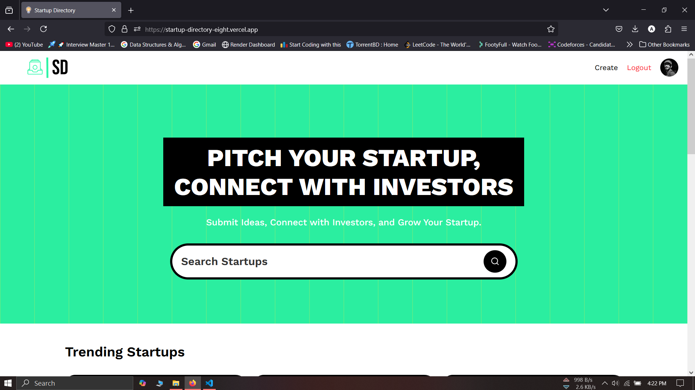
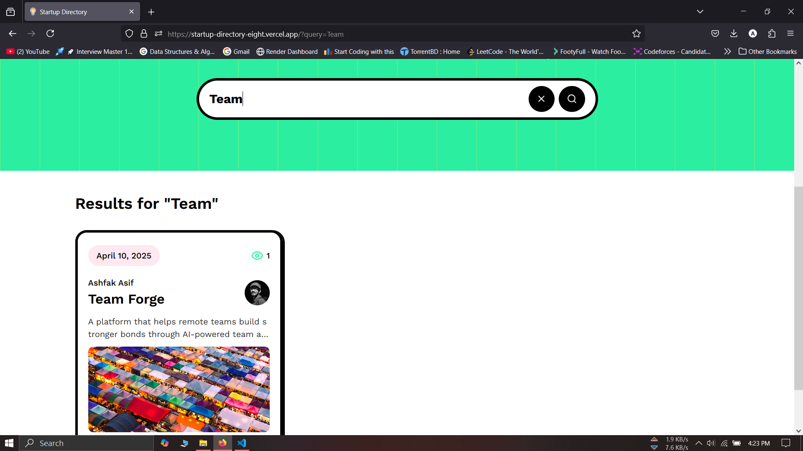
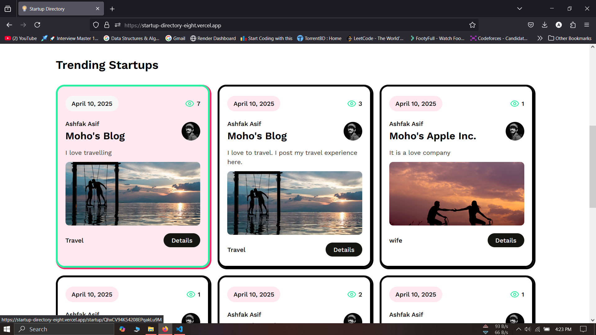

# Project Overview [(Project Link)](https://startup-directory-eight.vercel.app/)

<video controls autoplay width="1080">
  <source src="./public/video-doc.mp4" type="video/mp4">
  Your browser does not support the video tag.
</video>

Startup Directory is a platform where founders can list, pitch, and grow their startups — all in one place.

Whether you're at the idea stage or post-product launch, Startup Directory gives you the visibility, tools, and community to take your startup to the next level. Founders can showcase their startups, share their pitch, connect with other innovators, and attract potential investors — no gatekeeping, just growth.

# Tech Stack

- Next JS
- Saniy (Live content fetching)
- Shadcn
- Typescript
- Auth JS

# Challenges

- Live content fetching
- PPR
- ISR
- SSG

# Project Sneak Peek

